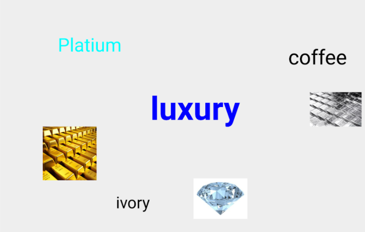
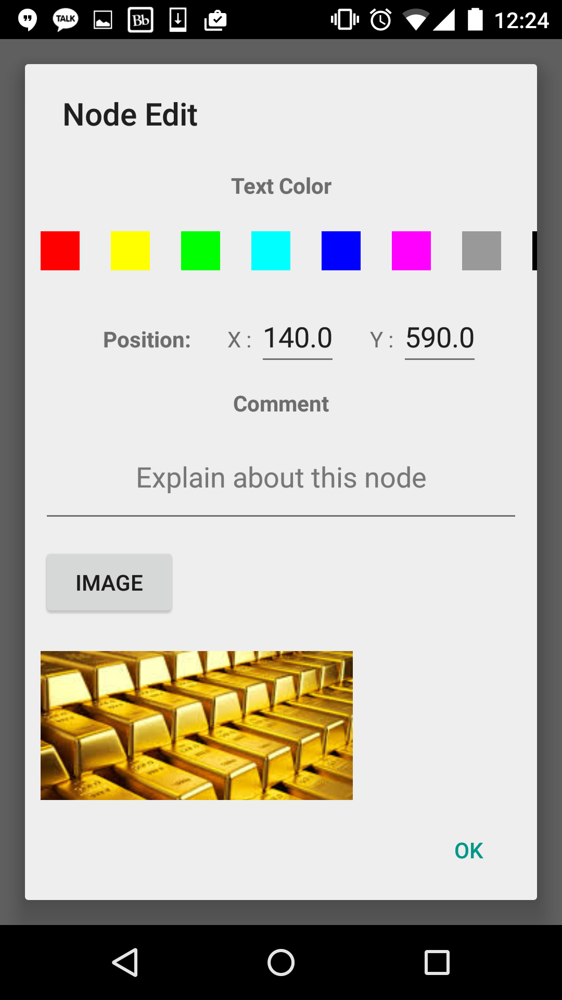
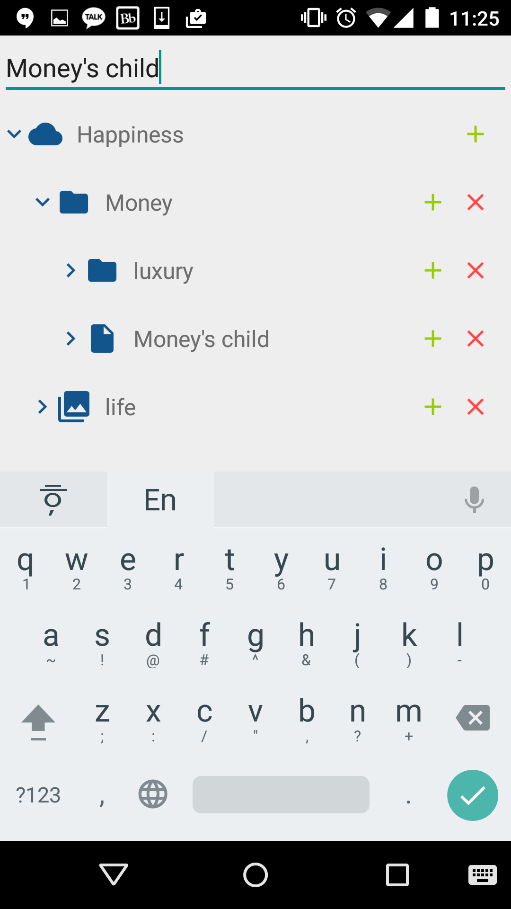
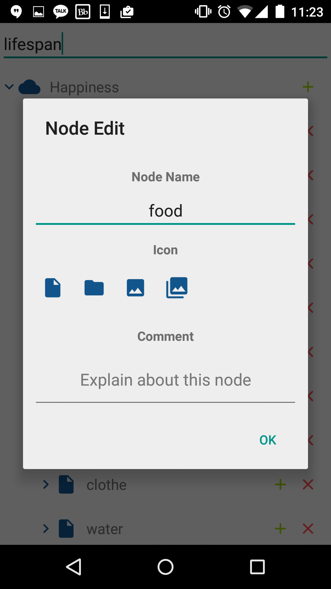

# [개인] 마인드맵 안드로이드 앱 제작 프로젝트
**This project has been deprecated. This may not be executable any more.**

**진행 기간**: 2015. 09. ~ 2015. 10.

**사용 언어/기술**: Java (안드로이드 타겟), AndroidTreeView

## 소개

마인드맵 형식으로 키워드 메모를 위해, 안드로이드 앱 제작을 기획 및 개발함.

메모 아이템들은 트리 형태로 구성되며, 가로 화면이면 특정 레벨의 마인드맵을 보여주고, 세로 화면이면 전체 아이템을 트리뷰 형태로 보여주게 함.

## 스크린샷

(가로 화면) 마인드맵 예시. 중앙의 'luxary' 중심의 키워드/사진을 주변에 배치함. 주변의 노드를 클릭하면, 그 노드의 레벨로 넘어감.

마인드 맵의 아이템을 편집하는 다이얼로그

(세로 화면) 전체 아이템을 트리로 표현

아이템이 트리로 표현될 때의 텍스트 및 아이콘 설정

